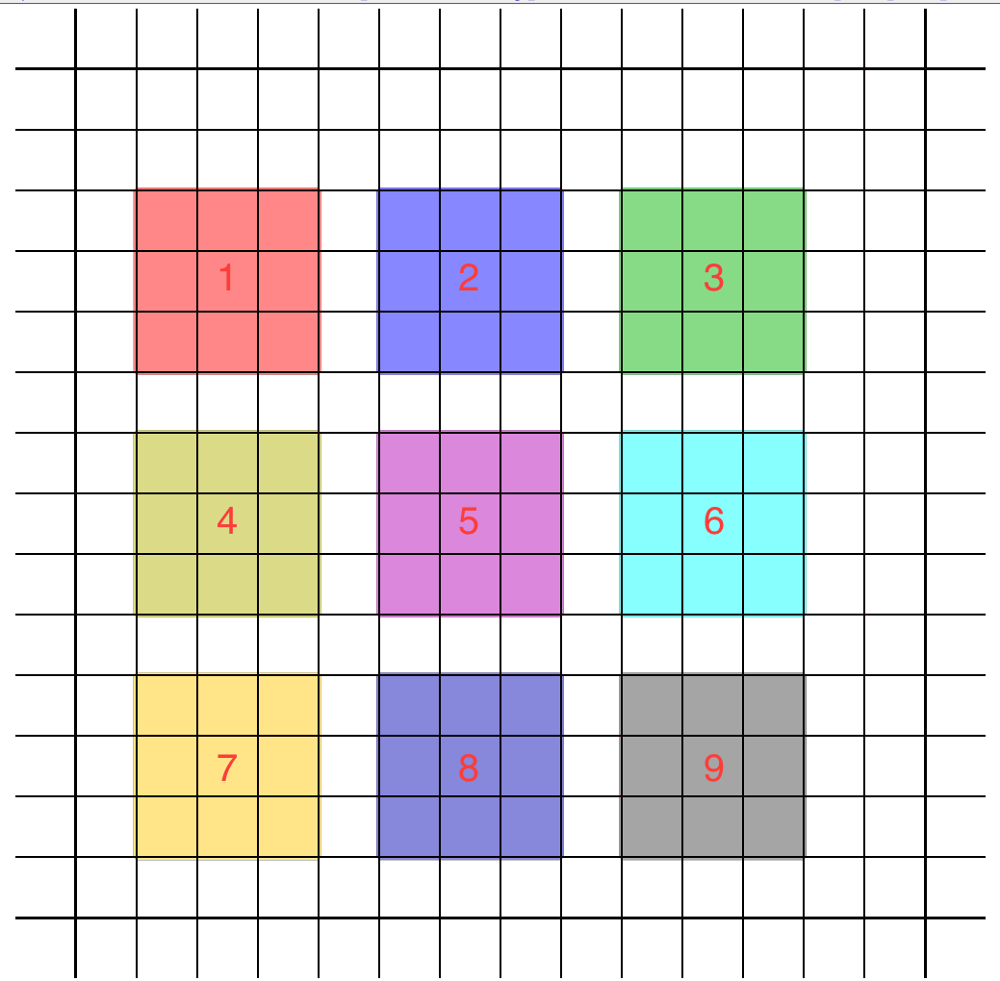
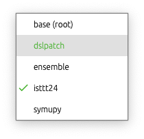
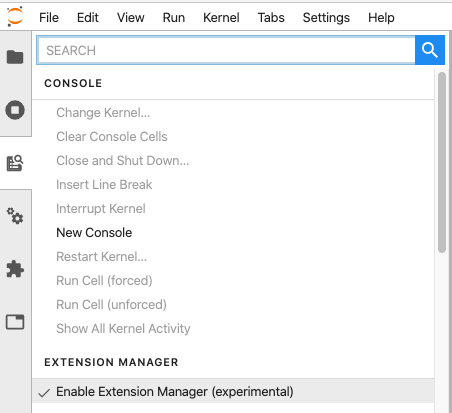
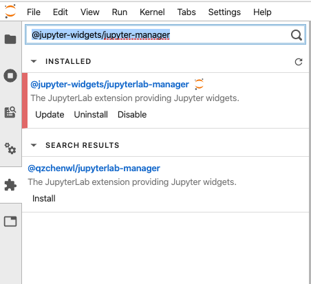
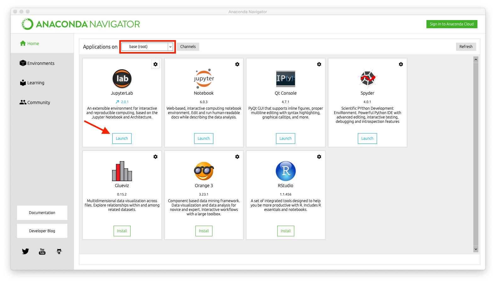
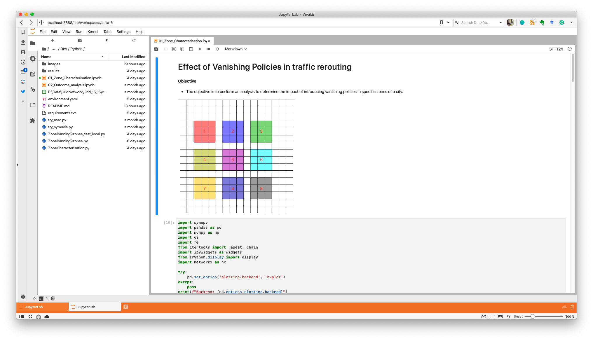

**| [Reproducibility](#reproducibility) | [Download](#download) | [Environment](#environment) | [Launch](#launch-simulations) | [License](#license) | [Contact](#contact) |**

# Launching and Analyzing for Vanishing Policies  

Results for multiple control policies and particularly vanishing output policies

<div style="text-align:center"></div>

**Important note**: In order to reproduce specific simulations in [01_Zone_Characterisation.ipynb](01_Zone_Characterisation.ipynb) you may need an installation on *SymuVia*. Please submit an [issue](https://github.com/aladinoster/vanishing-control-out/issues/new) to provide access to the installation.

## Reproducibility 

In order to reproduce the environment setup the environment for reproducibility of results. 

* A notebook containing evolution: [01_Zone_Characterisation.ipynb](01_Zone_Characterisation.ipynb). 

* A notebook containing analytics: [02_Outcome_analysis.ipynb](02_Outcome_analysis.ipynb)  

* Al result data is stored in the folder `results/`

## Download 

In order to install run in your command line tool:

```{bash}
git clone https://github.com/aladinoster/vanishing-control-out.git
```
Or obtain direct download [here](https://github.com/aladinoster/vanishing-control-out/archive/master.zip). 


## Environment

The basic environment setup consists in installation of a minimum set of packages that will allow the reproducibility of the conditions and results. 

### Minimum requirements

Be sure to have a version of Anaconda or download it [here](https://www.anaconda.com/distribution/). 

The following guidelines are meant to be executed in the terminal console: 

#### Create working environment

Open a bash terminal and execute: 

```
$conda env create -f environment.yml
```
#### Activate working environment

You may have access to the environment by activating it

```
$conda activate isttt24
```

or via the graphical interface. Select the drop down menu `Appplications on`



#### Setup extensions 

Via the command line interface:

```
$jupyter labextension install @jupyter-widgets/jupyterlab-manager 
```

Via the jupyter lab interface. Consider first launching the application (See down below)

**Installation** 
Consider latest version of `jupyterlab>= 2.0`. From the side menu enable the experimental extension manager

   

**Activation**
Look for and install the widget extension manager called `@jupyter-widgets/jupyter-manager` and click under install/update. 
 


## Launch simulations

Launch the simulations via the command line or

``` 
$cd ~
$jupyter lab 
```

Graphical interface. Be sure to select the correct environment before launching the `jupyter lab` application



Double click and open the corresponding notebook



**Note**: In case you are working with the dynamic evolution presented in[01_Zone_Characterisation.ipynb](01_Zone_Characterisation.ipynb). Double check the path where the library of SymuVia is located. Edit the variable `PATH_SYMUVIA` with your local installation. 


## License 

The code here contained is licensed under [MIT](LICENSE) license.

## Contact 

If you run into problems or bugs, please let us know by [creating an issue](https://ci.tno.nl/gitlab/paco.hamers-tno/ensemble_drivermodel/issues/new) an issue in this repository.